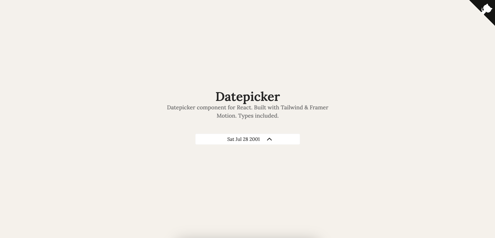

# Datepicker Component
A minimalistic datepicker for React. Built with Tailwind & Framer Motion



## Basic Usage
- Copy the [component](./demo/src/components/Datepicker.tsx) to your own project
- Install dependencies: `yarn add framer-motion lucide-react`

```tsx
<Datepicker onChange={(date) => console.log(date)} />

```

## Parameters
| Parameter | Type             | Use                                                 |
|-----------|------------------|-----------------------------------------------------|
| onChange  | `(date => void;` | Function that will trigger when the date is changed |
